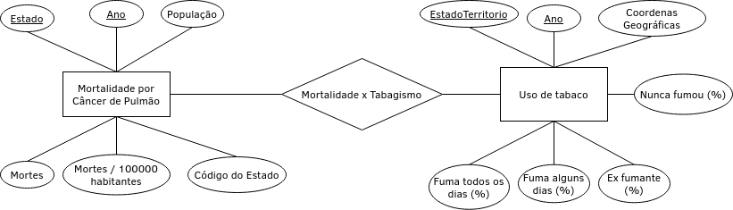
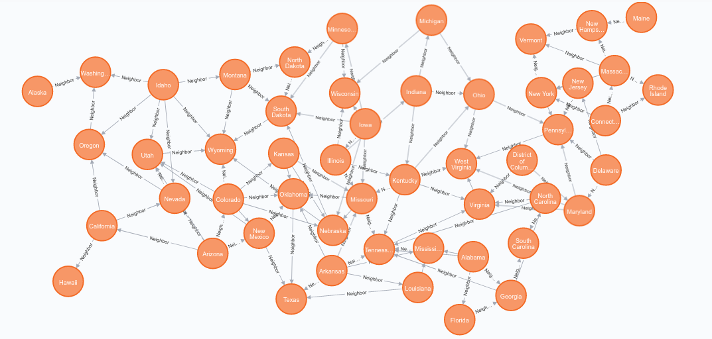
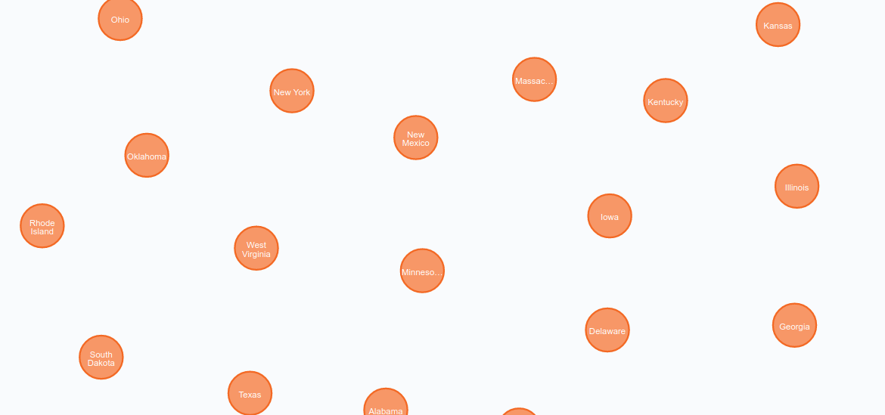

# Etapa 02

## Slides da Proposta

[Slides](slides/Stage02Presentation.pdf)

## Motivação e Contexto

Segundo o Center Disease Control (CDC), o câncer está atrás apenas de doenças cardiovasculares quando se trata do número de mortes. Além disso, o aumento da expectativa de vida média de um ser humano tem aumentado ainda mais o problema, já que a longevidade humana observada recentemente aumentou as chances de desenvolvimento de câncer em pacientes de mais idade principalmente.

Dentre os diversos tipos de câncer observados e estudados, o que causa mais mortes todos os anos é o câncer de pulmão onde a maior causa é a prática do tabagismo. Apesar de que está relação de causalidade entre a escolha de fumar e a doença ser conhecida por muitos e alertada por profissionais de saúde, foram vendidos 5.7 trilhões de cigarros em 2016, indicando que muitas pessoas ainda praticam o tabagismo mesmo com o conhecimento de seus males para a saúde.

Como se ainda não bastasse os efeitos do cigarro para a saúde, uma nova tendência de cigarros eletrônicos espalhada pelas mídias sociais conseguiu convencer jovens a começar a usar estes produtos. Apesar destes produtos serem vendidos como boas alternativas ao cigarro, já foram publicados estudos científicos que relacionam o uso destes com o câncer de pulmão, assim como acontece com o tabagismo tradicional.

## Método

Para estudar a relação entre tabagismo, câncer de pulmão e as mídias sociais serão seguidas as duas seguintes etapas de projeto:

1. Relacionamento entre a mortalidade por câncer e o uso de tabaco: dados de mortalidade por câncer de pulmão da API CDC Wonder que pertencem ao modelo de documentos (hierárquico) serão relacionados com o uso de tabaco por estado americano e ano da tabela Tobacco Use (que pertence ao modelo tabular - consultar bases de dados abaixo) para reproduzir a relação já conhecida entre ambas as partes. A análise será feita relacionando-se o número de mortes por câncer de pulmão em um determinado ano com os números de fumantes no ano atual e em anos anteriores por estado norte-americano. Espera-se concluir que mortes por câncer de pulmão são correlacionados com o uso de tabaco e fundamentar a pesquisa desta relação.
2. Relacionar a conectividade das redes sociais de fumantes pelos dados de contas do Facebook (que pertencem ao modelo de grafos) com o indíce de tabagismo em diversos estados americanos pela base de dados Tobacco Use (modelo tabular). A partir da análise conjunta entre estas duas bases de dados, espera-se concluir que a conectividade das redes sociais de tabagistas formam uma correlação proporcional com a prática de tabagismo em um nível nacional norte-americano.

## Bases de Dados

Título da base | Link | Descrição
----- | ----- | -----
CDC WONDER API for Data Query Web Service | [Wonder API](https://wonder.cdc.gov/wonder/help/WONDER-API.html) | Mortalidade nos Estados Unidos |
Tobacco Use 1995-2010 - Prevalence and Trends: Four Level Smoking Data | [Tobacco Use 1995-2010](https://www.kaggle.com/cdc/tobacco-use) | Registro do uso de tabaco de 1995 até 2010 por estado americano |
Data from "An exploration of the Facebook social networks of smokers and non-smokers"  | [Social Networks of Smokers and Non-Smokers](https://dataverse.harvard.edu/dataset.xhtml?persistentId=doi:10.7910/DVN/XMPAUQ) | Parâmetros das contas do Facebook de fumantes e não fumantes

# Etapa 03

## Primeiro Modelo Conceitual

## Primeiros Modelos Lógicos

### Modelo Relacional:

MORTALIDADE(<ins>**Estado**</ins>,<ins>**Ano**</ins>,População,Mortes,MortesPor100k,CodigoEstado)
TABAGISMO(<ins>**EstadoTerritorio**</ins>,<ins>**Ano**</ins>,NuncaFumou,ExFumante,FumaAsVezes,FumaSempre,Coordenadas)

## Primeiro programa de extração e conversão de dados

[Extração de dados](notebooks/lungcancerdataextraction.ipynb) 

[Conversão de dados](notebooks/lungcancerdataconverter.ipynb) 

## Primeiro conjunto de queries

[Queries SQL](notebooks/queries.ipynb) 

## Bases de Dados

Título da base | Link | Descrição
----- | ----- | -----
CDC WONDER API for Data Query Web Service | [Wonder API](https://wonder.cdc.gov/wonder/help/WONDER-API.html) | Mortalidade nos Estados Unidos |
Tobacco Use 1995-2010 - Prevalence and Trends: Four Level Smoking Data | [Tobacco Use 1995-2010](https://www.kaggle.com/cdc/tobacco-use) | Registro do uso de tabaco de 1995 até 2010 por estado americano |
Data from "An exploration of the Facebook social networks of smokers and non-smokers"  | [Social Networks of Smokers and Non-Smokers](https://dataverse.harvard.edu/dataset.xhtml?persistentId=doi:10.7910/DVN/XMPAUQ) | Parâmetros das contas do Facebook de fumantes e não fumantes

## Arquivos de Dados

Nome do arquivo | Link | Descrição
----- | ----- | -----
lungcancer1968-1978.txt | [lungcancer1968-1978.txt](data/raw/lungcancer1968-1978.txt) | Mortes por câncer de pulmão nos EUA de 1968 a 1978, não processados.
lungcancer1979-1998.txt | [lungcancer1979-1998.txt](data/raw/lungcancer1979-1998.txt) | Mortes por câncer de pulmão nos EUA de 1979 a 1998, não processados.
lungcancer1999-2018.txt | [lungcancer1999-2018.txt](data/raw/lungcancer1999-2018.txt) | Mortes por câncer de pulmão nos EUA de 1999 a 2018, não processados.
lungcancer1968-1978.csv | [lungcancer1968-1978.csv](data/processed/lungcancer1968-1978.csv) | Mortes por câncer de pulmão nos EUA de 1968 a 1978, por ano e por estado.
lungcancer1979-1998.csv | [lungcancer1979-1998.csv](data/processed/lungcancer1979-1998.csv) | Mortes por câncer de pulmão nos EUA de 1979 a 1998, por ano e por estado.
lungcancer1999-2018.csv | [lungcancer1999-2018.csv](data/processed/lungcancer1999-2018.csv) | Mortes por câncer de pulmão nos EUA de 1999 a 2018, por ano e por estado.
lungcancer.csv | [lungcancer.csv](data/processed/lungcancer.csv) | Mortes por câncer de pulmão nos EUA de 1968 a 2018, por ano e por estado
lungcancer-general.csv | [lungcancer-general.csv](data/processed/lungcancer-general.csv) | Mortes por câncer de pulmão nos EUA de 1968 a 2018, por ano.

# Etapa 04 - Análises com o Segundo Modelo Lógico

## Slides da Apresentação da Etapa

[Slides](slides/Stage04Presentation.pdf)

## Modelo Conceitual Atualizado

## Modelos Lógicos Atualizados

### Modelo Relacional

MORTALIDADE(<ins>**Estado**</ins>,<ins>**Ano**</ins>,População,Mortes,MortesPor100k,CodigoEstado)
TABAGISMO(<ins>**EstadoTerritorio**</ins>,<ins>**Ano**</ins>,NuncaFumou,ExFumante,FumaAsVezes,FumaSempre,Coordenadas)

### Modelo Grafos
Cada um dos estados norte-americanos será representado por um nó em um grafo, e terá arestas para os estados que são vizinhos. Além disso, cada um destes nós terá atributos como População e Mortes por ano.

## Programa de extração e conversão de dados atualizado

### Modelo Relacional

[Extração de dados](notebooks/lungcancerdataextraction.ipynb) 

[Conversão de dados](notebooks/lungcancerdataconverter.ipynb) 

## Conjunto de queries de dois modelos

### SQL:
[Queries SQL](notebooks/queries.ipynb) 

### Cypher:
Criando um nó para cada estado-norteamericano:
~~~cypher
LOAD CSV WITH HEADERS FROM 'https://raw.githubusercontent.com/ubikuity/List-of-neighboring-states-for-each-US-state/master/usa-states.csv' AS line
CREATE (:State {name: line.StateName, code: line.StateCode})
~~~

Colocando arestas entre estados vizinhos:
~~~cypher
LOAD CSV WITH HEADERS FROM 'https://raw.githubusercontent.com/ubikuity/List-of-neighboring-states-for-each-US-state/master/neighbors-states.csv' AS line
MATCH (s:State {code: line.StateCode})
MATCH (d:State {code: line.NeighborStateCode})
MERGE (s)-[:Neighbor]-(d)
~~~

Criando uma projeção nativa:
~~~cypher
CALL gds.graph.create(
    'stateGraph',
    'State',
    {
        Neighbor:{ 
            orientation: 'UNDIRECTED'
        } 
    } 
)
~~~

Usando a projeção para detectar comunidades:
~~~cypher
CALL gds.louvain.stream('stateGraph')
YIELD nodeId, communityId
RETURN gds.util.asNode(nodeId).name AS name, communityId
ORDER BY communityId ASC
~~~

Resultado:
Comunidade | Estados 
----- | -----
1 | Illinois, Indiana, Kentucky, Maryland, Michigan, New Jersey, Ohio, Pennsylvania, Virginia, Wisconsin, West Virginia, District of Columbia, Delaware
2 | Florida, Georgia, Louisiana, Mississippi, North Carolina, South Carolina, Tennessee, Texas, Alabama, Arkansas
3 | Iowa, Kansas, Minnesota, Missouri, Montana, North Dakota, Nebraska, Oklahoma, South Dakota, Wyoming, Colorado
4 | Idaho, New Mexico, Nevada, Oregon, Utah, Washington, Alaska, Arizona, California
5 | Massachusetts, Maine, New Hampshire, New York, Rhode Island, Vermont, Vermont

Salvando a comunidade em cada um dos nós dos estados:
~~~cypher
CALL gds.louvain.stream('stateGraph')
YIELD nodeId, communityId
MATCH (s:State {name: gds.util.asNode(nodeId).name})
SET s.community = communityId
~~~

Salvando o número de mortes por câncer de pulmão em 2018 em cada um dos nós do grafo:
~~~cypher
LOAD CSV WITH HEADERS FROM 'https://raw.githubusercontent.com/GSPAtens/Trabalho_Final-MC536-2s2020/main/stage04/data/processed/lungcancer1999-2018.csv' AS line
MATCH (s:State)
WHERE line.State = s.name AND line.Year = '2018'
SET s.lungCancerDeaths = toInteger(line.Deaths)
SET s.year = toInteger(line.Year)
~~~

Somando o número de mortes por câncer em 2018 por todos os estados:
~~~cypher
MATCH (s:State)
RETURN (sum(s.lungCancerDeaths))
~~~

Média de mortes por estado:
~~~cypher
MATCH (s:State)
RETURN (avg(s.lungCancerDeaths))
~~~

Exportando as análises para um meio externo:
~~~cypher
MATCH(s:State)
RETURN s.code, s.name, s.community, s.lungCancerDeaths, s.year
~~~

A visualização destas análises pode ser feita usando o resultado da query anterior em programas de visualização de grafos como o Cytoscape/Gephi.
## Bases de Dados

Título da base | Link | Descrição
----- | ----- | -----
CDC WONDER API for Data Query Web Service | [Wonder API](https://wonder.cdc.gov/wonder/help/WONDER-API.html) | Mortalidade nos Estados Unidos |
Tobacco Use 1995-2010 - Prevalence and Trends: Four Level Smoking Data | [Tobacco Use 1995-2010](https://www.kaggle.com/cdc/tobacco-use) | Registro do uso de tabaco de 1995 até 2010 por estado americano |
Data from "An exploration of the Facebook social networks of smokers and non-smokers"  | [Social Networks of Smokers and Non-Smokers](https://dataverse.harvard.edu/dataset.xhtml?persistentId=doi:10.7910/DVN/XMPAUQ) | Parâmetros das contas do Facebook de fumantes e não fumantes
List of neighboring states for each US state | [List-of-neighboring-states-for-each-US-state](https://github.com/ubikuity/List-of-neighboring-states-for-each-US-state) | Lista de estados americanos e seus vizinhos

## Arquivos de Dados

Nome do arquivo | Link | Descrição
----- | ----- | -----
lungcancer1968-1978.txt | [lungcancer1968-1978.txt](data/raw/lungcancer1968-1978.txt) | Mortes por câncer de pulmão nos EUA de 1968 a 1978, não processados.
lungcancer1979-1998.txt | [lungcancer1979-1998.txt](data/raw/lungcancer1979-1998.txt) | Mortes por câncer de pulmão nos EUA de 1979 a 1998, não processados.
lungcancer1999-2018.txt | [lungcancer1999-2018.txt](data/raw/lungcancer1999-2018.txt) | Mortes por câncer de pulmão nos EUA de 1999 a 2018, não processados.
usa-states.csv | [usa-states.csv](data/external/usa-states.csv) | Estados americanos.
neighbors-states.csv | [neighbors-states.csv](data/external/neighbors-states.csv) | Estados americanos e seus vizinhos.
lungcancer1968-1978.csv | [lungcancer1968-1978.csv](data/processed/lungcancer1968-1978.csv) | Mortes por câncer de pulmão nos EUA de 1968 a 1978, por ano e por estado.
lungcancer1979-1998.csv | [lungcancer1979-1998.csv](data/processed/lungcancer1979-1998.csv) | Mortes por câncer de pulmão nos EUA de 1979 a 1998, por ano e por estado.
lungcancer1999-2018.csv | [lungcancer1999-2018.csv](data/processed/lungcancer1999-2018.csv) | Mortes por câncer de pulmão nos EUA de 1999 a 2018, por ano e por estado.
lungcancer.csv | [lungcancer.csv](data/processed/lungcancer.csv) | Mortes por câncer de pulmão nos EUA de 1968 a 2018, por ano e por estado
lungcancer-general.csv | [lungcancer-general.csv](data/processed/lungcancer-general.csv) | Mortes por câncer de pulmão nos EUA de 1968 a 2018, por ano.
