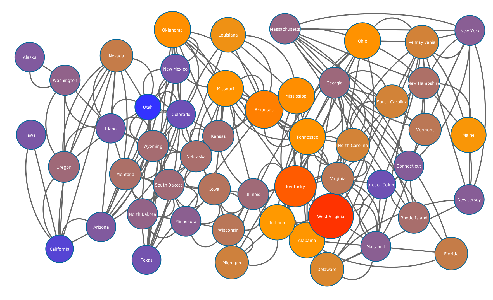

# Etapa Final

## Projeto Câncer de pulmão e tabagismo

## Equipe Dados de Bancos
* Vitor Celso Horodynski Alves

## Slides da Apresentação da Etapa Final

[Slides](slides/StageFinalPresentation.pdf)

## Resumo do Projeto

O projeto desenvolvido visa observar o relacionamento cientificamente comprovado entre o câncer de pulmão e tabagismo, usando como base de dados a população dos EUA. Para tanto, foram analisados registros de mortalidade por câncer de pulmão e os índices de fumantes, em diversos estados e anos de pesquisa do tabagismo. A partir destes do tratamento destes dados e subsequente análises pelas ferramentas de bancos de dados relacionais, o modelo de grafos foi usado para gerar análises visuais que demonstrem a correlação entre estes dois principais conjuntos de dados.

## Motivação e Contexto

Segundo o Center Disease Control (CDC), o câncer está atrás apenas de doenças cardiovasculares quando se trata do número de mortes. Além disso, o aumento da expectativa de vida média de um ser humano tem aumentado ainda mais o problema, já que a longevidade humana observada recentemente aumentou as chances de desenvolvimento de câncer em pacientes de mais idade principalmente.

Dentre os diversos tipos de câncer observados e estudados, o que causa mais mortes todos os anos é o câncer de pulmão onde a maior causa é a prática do tabagismo. Apesar de que está relação de causalidade entre a escolha de fumar e a doença ser conhecida por muitos e alertada por profissionais de saúde, foram vendidos 5.7 trilhões de cigarros em 2016, indicando que muitas pessoas ainda praticam o tabagismo mesmo com o conhecimento de seus males para a saúde.

Como se ainda não bastasse os efeitos do cigarro para a saúde, uma nova tendência de cigarros eletrônicos espalhada pelas mídias sociais conseguiu convencer jovens a começar a usar estes produtos. Apesar destes produtos serem vendidos como boas alternativas ao cigarro, já foram publicados estudos científicos que relacionam o uso destes com o câncer de pulmão, assim como acontece com o tabagismo tradicional.

## Detalhamento do Projeto

A extração e conversão de dados da API CDC Wonder foram as principais atividades de pré-processamento dos dados necessários para as taxas de mortalidade do câncer de pulmão. No caso da extração, foi desenvolvida uma classe em Python para obter os dados de maneira automatizada:

~~~python
db = WonderAPIQuery(parameter_list,["Year","Deaths","Population","CrudeRate"])
data = db.fetchData()
db.saveResultToCSV(base_data_path,'lungcancer-general')
~~~

Esta classe encapsula um request enviado ao endereço da API, bem como o tratamento dos dados a partir de um modelo de documentos para uma tabela em .csv, posteriormente importada para uma SGDB. Os detalhes de implementação desta classe podem ser encontrados [neste notebook](notebooks/lungcancerdataextraction.ipynb) , em que o modelo de documentos foi convertido para um dicionário, visando facilitar a extração apenas dos campos requiridos para a tabela final.

Entretanto, a API precisa de diferentes conjuntos de argumentos para diferentes anos da pesquisa de mortalidade por conta das mudanças que ocorreram ao longo do tempo com os códigos ICD e com o próprio sistema da base de dados. Deste modo, foi necessário obter os dados dos outros anos da pesquisa manualmente e então padronizar sua exibição, de modo a unificar as bases de dados de diferentes anos de pesquisa em apenas uma única tabela. [O script](notebooks/lungcancerdataconverter.ipynb)  basicamente converte arquivos de texto baixados manualmente em dataframes da biblioteca Pandas, e então usa uma própria funcionalidade da biblioteca para juntar todos estes dataframes em apenas um, que é salvo como um arquivo csv:

~~~python
combined_csv = pd.concat([pd.read_csv(base_dataset_name + f + '.csv') for f in datasets])
combined_csv.to_csv(base_dataset_name + '.csv',index=False)
~~~

Por outro lado, os dados de consumo de tabaco nos estados dos EUA já estavam consolidados e compatíveis com o modelo relacional. Assim, a consolidação destes dois conjuntos de dados permitiu que estes fossem importados para um SGBD e analisados em busca de tendências de mortalidade e tabagismo, tanto por estado como ano da série histórica, já outra possibilidade de análise foi a criação de tabelas que apresentassem o problema de forma macro, juntando os dados de diversos estados para formar a média nacional do ano e vice-versa. Estas análises são a base para as análises posteriores e podem ser observadas no arquivo de [queries](notebooks/queries.ipynb) .

Finalmente, a partir da consolidação dos dados e análises pelos bancos de dados relacionais, o modelo de bancos de dados grafos foi usado para gerar visualizações que envolviam tanto o tabagismo como a mortalidade por câncer de pulmão. Para tanto, foi gerado um grafo cujos nós representavam cada um dos estados norte-americanos e uma aresta representando a vizinhança entre os dados por meio de uma base de dados já existentes, que incluia a [lista de estados](data/external/usa-states.csv) e os [vizinhos de cada um dos estados](data/external/neighbors-states.csv), e então os dados consolidados de tabagismo e mortalidade foram importados para cada um destes nós para gerar uma tabela csv que pode ser usado para gerar uma visualização do grafo a partir do [Cytoscape](notebooks/analysis.cys).

## Evolução do Projeto

A decisão inicial do projeto foi definir que o tema a ser tratado com relação a área da saúde seria o câncer, e que os dados publicamente disponíveis seriam usados para relacionar hábitos de vida e o câncer, como alimentação e práticas esportivas. Além disso, o trabalho envolveria também uma componente de analisar as mídias sociais de pessoas que tivessem alguma relação com o tema, seja por meio do câncer os da qualidade de vida das pessoas.

Entretanto, a medida com que a pesquisa foi feita e das orientações para o projeto, percebeu-se a necessidade de especificar de maneira mais exata com qual tipo de câncer e com que hábitos de vida se desejava trabalhar. Por ser um dos cânceres mais comuns e mais estudados e o fato de apresentar uma grande quantidade de dados disponíveis para a análise, dada a influência do tabaco sob a doença compravada cientificamente, relacionar o câncer de pulmão e o tabagismo especificou melhor e o tema e demonstrou uma direção viável para a relação que se gostaria de mostrar. Ainda assim, a análise de mídias sociais de pessoas com câncer não se mostrou eficiente, apesar de existirem dados de um estudo cientifíco que estudou a diferença entre as redes sociais de fumantes e não fumantes, por conta da dificuldade de relacionar as outras bases de dados com medidas de redes sociais apresentadas pelo artigo.

Deste modo, o projeto começou a ser desenvolvido por meio de scripts automatizados que tratavam os dados da API CDC Wonder e transformavam estes dados em uma tabela csv. Devido a dificuldades com o uso da API e os requerimentos para uso, como um documento XML de entrada, um [repositório](https://github.com/alipphardt/cdc-wonder-api) guia foi usado para transformar os dados da API nas referidas tabelas. Entretanto, este script foi escrito por um terceiro e não resolvia todos as necessidades do projeto, já que não se funcionava para as bases de dados mais antigas da API Wonder. Assim, com base na geração do documento XML necessário para o request para a API, outro [script](notebooks/lungcancerdataextraction.ipynb)  próprio foi escrito para desenvolver o projeto de forma original e [mais um](notebooks/lungcancerdataconverter.ipynb)  para tratar dos documentos que não podiam ser obtidos por meio de requests automatizados.

A partir destes da consolidação dos dados usados a partir destes scripts, foi possível usa-los para construir o modelo relacional. Por conta da simplicidade deste modelo relacional usado, que continha duas tabelas com estado e ano e dados relevantes de tabagismo e mortalidade por câncer de pulmão, o modelo não mudou ao longo do tempo e foi estabelecido desde sua concepção. O resultado da aplicação do modelo relacional foram requisições com o objetivo de revelar as características e casos graves de mortalidade pelo câncer e tabagismo nos EUA, como exemplificado pelas [queries](notebooks/queries.ipynb) .

Por fim, o conhecimento do problema obtido a partir do uso de banco de dados relacionais apontou anos e faixas de dados relevantes para uma análise visual por meio do modelo de bancos de dados de grafos. Tais análises envolveram tanto o número absoluto de casos de mortalidade como o número relativo pela população, a prevalência do tabagismo em cada um dos estados em determinados anos e a criação de índices que relacionam as duas métricas. Estas quantidades foram demonstradas tanto pela cor de um nó representante de um estado quanto pelo seu tamanho, o que proveu uma gama de possibilidades para a visualização do câncer de pulmão relacionado ao tabagismo.

## Resultados e Discussão

* Padrão de consumo do tabaco - Mapa de calor do uso de tabaco em 1995 contra 2010, onde o tamanho e as cores dos nós indicam a gravidade do problema:

1995 | 2010
----- | -----
 | 

Nesta comparação entre a prevalência do tabagismo em 1995 contra 2010, pode-se ver que muitos dos estados que tinham um índice de fumantes comparável ao máximo nacional em 1995 demonstraram uma grande diminuição do problema até 2010, o que permite inferir uma mudança no padrão de consumo ao longo dos anos. A pesquisa do uso de tabaco disponível cobria apenas os extremos entre 1995 e 2010, e portanto apenas os extremos foram explorados.

* Correlação entre uso de tabaco diário e câncer - Índices

Dois índices foram experimentados como uma tentativa de demonstrar uma correlação entre o uso de tabaco e a mortalidade por câncer de pulmão por estado norte-americano:

    Divisivo: multiplica a porcentagem da população que faz uso tabaco diariamente com o número de mortes por câncer de pulmão per capita.
    Multiplicativo: divide a porcentagem da porcentagem da população que faz uso diário de tabaco pelo número de mortes por câncer de pulmão per capita.

Usando este índice para o ano de 2010, e usando o tamanho e a cor dos nós proporcionais ao tamanho de cada um dos nós:

Multiplicativo | Divisivo
----- | -----
 | 

Pode-se perceber que o índice multiplicativo tem uma variância enorme entre os diversos estados, o que ocorre por ser proporcional a (1/População)^2. Como gostaríamos que o índice fosse adimensional e uma medida aproximada da correlação entre mortalidade e tabagismo, o índice divisivo representa muito melhor tal correlação, como pode ser visto pela menor variância entre os nós presentes no grafo.

Apesar de não provar a correlação entre tabagismo e câncer de pulmão, o índice divisivo pode ser um início para mostrar a relação entre as duas quantidades. Uma análise mais profunda usando conhecimentos de estatística poderia aprimorar a demonstração entre estas correlações, além de poder contar com dados mais detalhados como o número de diagnósticos de câncer de pulmão e não apenas os índices de mortalidade.

* Análise absoluta x Análise per capita

As análises visuais feitas para este projeto podem envolver tanto quantidade absolutas de mortos como quantidade per capita com relação a população, o que pode levar um observador a tirar conclusões para um lado ou para outro a depender do que está sendo exibido. Os gifs a seguir exibem o mapa de calor de 1968 a 2018 (de 10 em 10 anos) e tem tamanho e cor proporcionais a sua métrica respectiva:

Absoluta | Per Capita
----- | -----
 | 

Com o objetivo de mitigar esta diferença entre as duas métricas, grafos que combinam as duas métricas podem ser construídos, em que as cores são usadas para mostrar um maior número de mortes per capita e o tamanho é proporcional ao total absoluto de mortes: 

* Série histórica do número de mortos por câncer de pulmão nos EUA

A partir dos dados consolidados da API, é possível construir um gráfico para exibir a curva de mortos por câncer de pulmão ao longo dos anos.

A partir deste gráfico, é possível perceber que o pico do câncer de pulmão nos EUA ocorreu nos anos 90 e vem diminuindo desde então. Estes dados são observados também nas análises visuais pelos grafos gerados, principalmente na série histórica de mortes absolutas.

## Conclusões

O desenvolvimento deste projeto permitiu perceber que o desenvolvimento de atividades relacionadas ao tratamento de dados requerem uma enorme quantidade de passos de preparação antes de realmente lidar com tabelas. Deste modo, a integração entre diversas tecnologias e linguagens de programação é essencial para o bom desenvolvimento de projetos que lidam com uma quantia de dados significativa e tão importante quanto construir requisições para uma linguagem SQL ou de outros modelos de bancos de dados. Outra conclusão importante é a necessidade de lidar com sistemas legados e antigos, que foram encontrados muitas vezes neste projeto, e como a robustez de tais sistemas e dos formatos de arquivo dos mesmos servem de aprendizado para a construção de sistemas próprios futuramente.

Pelo lado prático, é importante notar os graves riscos do tabagismo para a saúde, visto que foi possível observar a correlação entre tabagismo e mortalidade por câncer de pulmão. Deste modo, foi positivo perceber que o consumo de tabaco e os números da mortalidade pelo câncer estão diminuindo nos EUA, o que não quer dizer que todo o mundo esteja caminhando nesta direção e nem que a diminuição do consumo esteja relacionada com a diminuição da mortalidade, ou seja, o projeto desenvolvido foi um grande lembrete de que correlação não implica causalidade, mesmo estabelecendo a relação visual entre mortalidade e tabagismo.

## Modelo Conceitual Final

## Modelos Lógicos Finais

MORTALIDADE(<ins>**Estado**</ins>,<ins>**Ano**</ins>,População,Mortes,MortesPor100k,CodigoEstado)

TABAGISMO(<ins>**EstadoTerritorio**</ins>,<ins>**Ano**</ins>,NuncaFumou,ExFumante,FumaAsVezes,FumaSempre,Coordenadas)

### Modelo Grafos
Cada um dos estados norte-americanos será representado por um nó em um grafo, e terá arestas para os estados que são vizinhos. Além disso, tem atributos relacionados ao dados de mortalidade por câncer de pulmão e de tabagismo, como no exemplo a seguir:

## Programa de extração e conversão de dados atualizado

[Extração de dados](notebooks/lungcancerdataextraction.ipynb) 

[Conversão de dados](notebooks/lungcancerdataconverter.ipynb) 

## Conjunto de queries para todos os modelos

### Modelo Relacional:
[Queries SQL](notebooks/queries.ipynb) 

### Modelo de Grafos:
Criando um nó para cada estado-norteamericano:
~~~cypher
LOAD CSV WITH HEADERS FROM 'https://raw.githubusercontent.com/ubikuity/List-of-neighboring-states-for-each-US-state/master/usa-states.csv' AS line
CREATE (:State {name: line.StateName, code: line.StateCode})
~~~

Criando arestas entre estados vizinhos:
~~~cypher
LOAD CSV WITH HEADERS FROM 'https://raw.githubusercontent.com/ubikuity/List-of-neighboring-states-for-each-US-state/master/neighbors-states.csv' AS line
MATCH (s:State {code: line.StateCode})
MATCH (d:State {code: line.NeighborStateCode})
MERGE (s)-[:Neighbor]-(d)
~~~

Colocando os dados de mortalidade por câncer de pulmão em cada um dos nós, para o ano de 2010:
~~~cypher
LOAD CSV WITH HEADERS FROM 'https://raw.githubusercontent.com/GSPAtens/Trabalho_Final-MC536-2s2020/main/stagefinal/data/processed/lungcancer.csv' AS line
MATCH (s:State)
WHERE line.State = s.name AND line.Year = '2010'
SET s.lungCancerDeaths = toInteger(line.Deaths)
SET s.crudeRate = toFloat(line.CrudeRate)
SET s.year = toInteger(line.Year)
~~~

Colocando os dados de uso de tabaco para cada um dos nós, para o ano de 2010:
~~~cypher
LOAD CSV WITH HEADERS FROM 'https://raw.githubusercontent.com/GSPAtens/Trabalho_Final-MC536-2s2020/main/data/tobacco.csv' AS line
MATCH (s:State)
WHERE line.State = s.name AND line.Year = '2010'
SET s.smokers = toFloat(line.SmokeEveryday)
SET s.smokerlungcancerindex = s.smokers / s.crudeRate
~~~

Criando uma projeção nativa:
~~~cypher
CALL gds.graph.create(
    'stateGraph',
    'State',
    {
        Neighbor:{ 
            orientation: 'UNDIRECTED'
        } 
    } 
)
~~~

Usando a projeção para detectar comunidades:
~~~cypher
CALL gds.louvain.stream('stateGraph')
YIELD nodeId, communityId
RETURN gds.util.asNode(nodeId).name AS name, communityId
ORDER BY communityId ASC
~~~

Salvando a comunidade em cada um dos nós dos estados:
~~~cypher
CALL gds.louvain.stream('stateGraph')
YIELD nodeId, communityId
MATCH (s:State {name: gds.util.asNode(nodeId).name})
SET s.community = communityId
~~~

Exportando os dados para posterior análise pelo Cytoscape:
~~~cypher
MATCH (s:State)
MATCH (d:State) 
MATCH (s)-[:Neighbor]-(d)
RETURN s.name,s.code,d.name,d.code,s.year,s.lungCancerDeaths,s.crudeRate,s.community
~~~

## Bases de Dados

Título da base | Link | Descrição
----- | ----- | -----
CDC WONDER API for Data Query Web Service | [Wonder API](https://wonder.cdc.gov/wonder/help/WONDER-API.html) | Mortalidade nos Estados Unidos |
Tobacco Use 1995-2010 - Prevalence and Trends: Four Level Smoking Data | [Tobacco Use 1995-2010](https://www.kaggle.com/cdc/tobacco-use) | Registro do uso de tabaco de 1995 até 2010 por estado americano |
Data from "An exploration of the Facebook social networks of smokers and non-smokers"  | [Social Networks of Smokers and Non-Smokers](https://dataverse.harvard.edu/dataset.xhtml?persistentId=doi:10.7910/DVN/XMPAUQ) | Parâmetros das contas do Facebook de fumantes e não fumantes
List of neighboring states for each US state | [List-of-neighboring-states-for-each-US-state](https://github.com/ubikuity/List-of-neighboring-states-for-each-US-state) | Lista de estados americanos e seus vizinhos

## Arquivos de Dados

Nome do arquivo | Link | Descrição
----- | ----- | -----
lungcancer1968-1978.txt | [lungcancer1968-1978.txt](data/raw/lungcancer1968-1978.txt) | Mortes por câncer de pulmão nos EUA de 1968 a 1978, não processados.
lungcancer1979-1998.txt | [lungcancer1979-1998.txt](data/raw/lungcancer1979-1998.txt) | Mortes por câncer de pulmão nos EUA de 1979 a 1998, não processados.
lungcancer1999-2018.txt | [lungcancer1999-2018.txt](data/raw/lungcancer1999-2018.txt) | Mortes por câncer de pulmão nos EUA de 1999 a 2018, não processados.
usa-states.csv | [usa-states.csv](data/external/usa-states.csv) | Estados americanos.
neighbors-states.csv | [neighbors-states.csv](data/external/neighbors-states.csv) | Estados americanos e seus vizinhos.
lungcancer1968-1978.csv | [lungcancer1968-1978.csv](data/processed/lungcancer1968-1978.csv) | Mortes por câncer de pulmão nos EUA de 1968 a 1978, por ano e por estado.
lungcancer1979-1998.csv | [lungcancer1979-1998.csv](data/processed/lungcancer1979-1998.csv) | Mortes por câncer de pulmão nos EUA de 1979 a 1998, por ano e por estado.
lungcancer1999-2018.csv | [lungcancer1999-2018.csv](data/processed/lungcancer1999-2018.csv) | Mortes por câncer de pulmão nos EUA de 1999 a 2018, por ano e por estado.
lungcancer.csv | [lungcancer.csv](data/processed/lungcancer.csv) | Mortes por câncer de pulmão nos EUA de 1968 a 2018, por ano e por estado
lungcancer-general.csv | [lungcancer-general.csv](data/processed/lungcancer-general.csv) | Mortes por câncer de pulmão nos EUA de 1968 a 2018, por ano.
